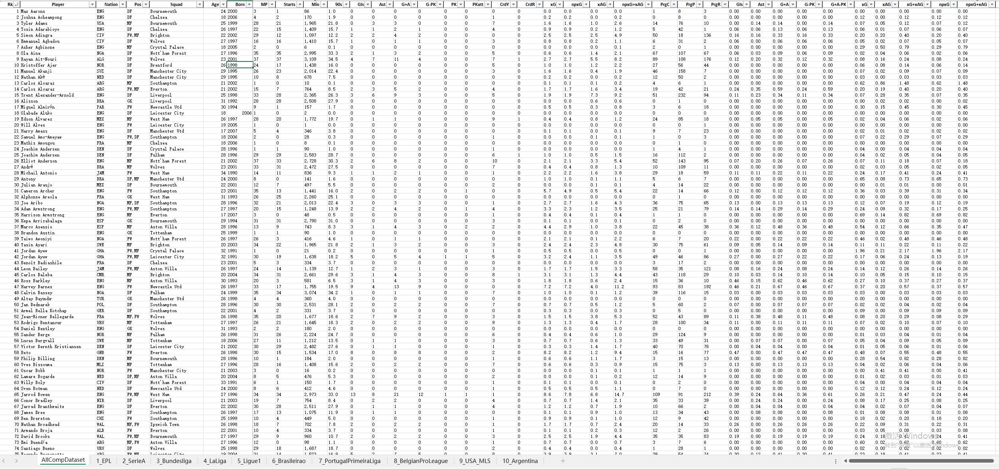
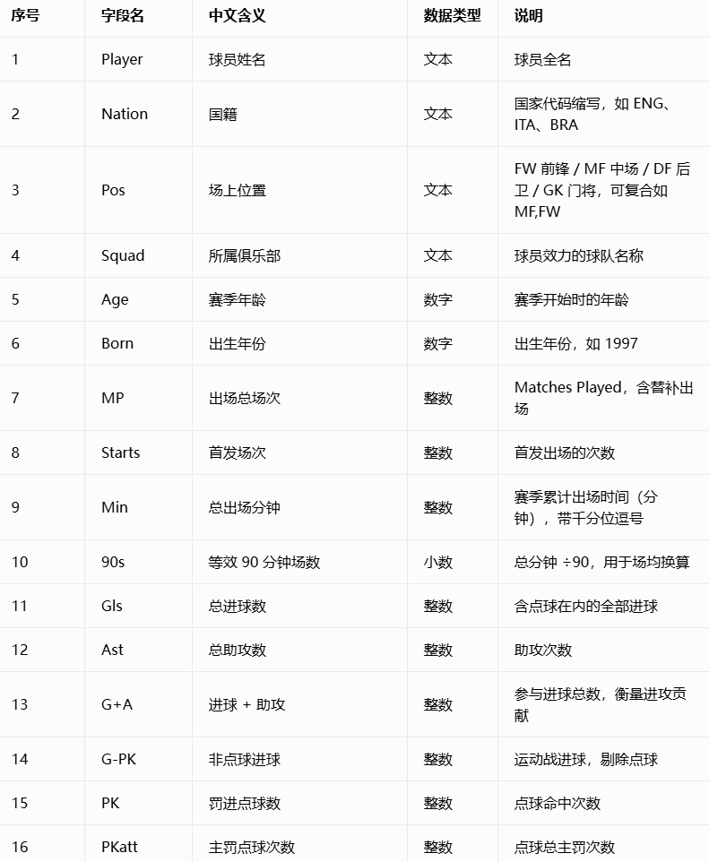
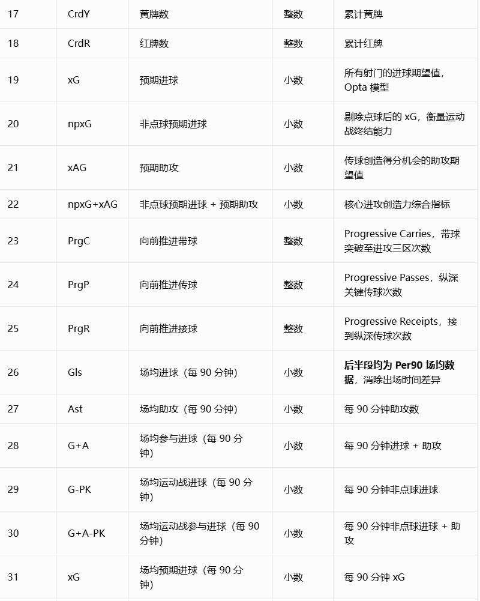
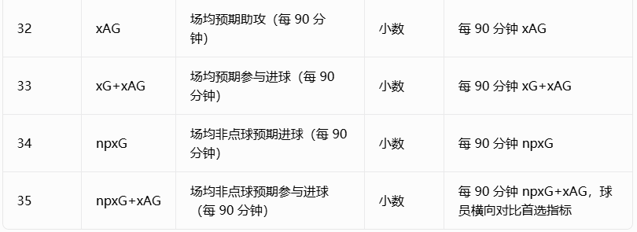

## Body

2024-25赛季全球10个联赛球员统计数据

该数据集汇集了2024-25赛季全球10个顶级足球联赛的详细球员统计数据。Excel文件中的每张表格代表不同的联赛，合并表格（AllCompDataset）会将它们合并成统一数据集，便于分析。

涵盖联赛：英超（英格兰），意甲（意大利），西甲（西班牙），德甲（德国），法甲（法国），巴西甲级联赛，葡萄牙甲级联赛，比利时职业联赛，美国职业足球大联盟（MLS），阿根廷甲级联赛（阿根廷）

统计字段包括：
- 球员姓名
- 国籍
- 年龄
- 位置
- 进球数
- 助攻数
- 黄牌数
- 红牌数
- 出场次数
- 总比赛时间
- 平均比赛时间
- 总射门次数
- 射正次数
- 控球率
- 传球成功率
- 抢断次数
- 拦截次数
- 解围次数
- 犯规次数
- 角球次数
- 点球次数
- 扑救次数
- 扑救成功率
- 黄牌/红牌比
- 进球/失球比
- 胜率
- 平局率
- 净胜球
- 总积分
- 排名

这些数据为足球分析师、教练和俱乐部提供了宝贵的信息，帮助他们更好地理解球员的表现和球队的整体表现。

## Images

item_1065539724085

Here is a pay link on Stripe ( https://buy.stripe.com/3cs8yP7sY87d0vu9AB ). Please contact me lonlonago@foxmail.com after funding $89, and I will send you a complete data files , thank you!

